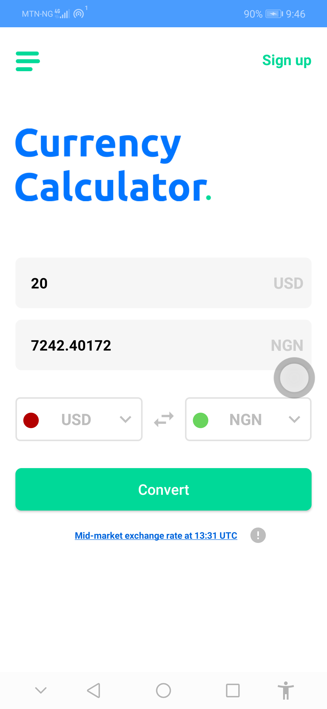

# CurrencyCalculatorKotlin
Currency Calculator App
- [x] This app uses fixer.io for currency conversion

The app uses the following third party lib
♟ Retrofit
♟ Room
♟ EventBus



### build.gradle
```
dependencies {
    implementation fileTree(dir: 'libs', include: ['*.jar'])
    implementation 'androidx.appcompat:appcompat:1.1.0-rc01'
    implementation 'androidx.constraintlayout:constraintlayout:1.1.3'
    testImplementation 'junit:junit:4.12'
    androidTestImplementation 'androidx.test:runner:1.2.0'
    androidTestImplementation 'androidx.test.espresso:espresso-core:3.2.0'
    implementation 'com.squareup.retrofit2:retrofit:2.6.1'
    implementation 'com.squareup.retrofit2:converter-scalars:2.6.1'
    implementation 'android.arch.persistence.room:runtime:1.1.1'
    annotationProcessor 'android.arch.persistence.room:compiler:1.1.1'
    testImplementation 'android.arch.persistence.room:testing:1.1.1'
    implementation 'com.google.android.material:material:1.0.0'
    implementation 'com.github.PhilJay:MPAndroidChart:v3.1.0'
    implementation 'org.greenrobot:eventbus:3.0.0'
    androidTestImplementation 'com.android.support.test:runner:1.0.2'
    androidTestImplementation 'com.android.support.test:rules:1.0.2'
    implementation "androidx.core:core-ktx:1.0.2"
    implementation "org.jetbrains.kotlin:kotlin-stdlib-jdk7:$kotlin_version"
    implementation "android.arch.lifecycle:extensions:1.1.1"
    kapt "android.arch.lifecycle:compiler:1.1.1"

    // Room Kotlin
    implementation "android.arch.persistence.room:runtime:1.1.1"
    kapt "android.arch.persistence.room:compiler:1.1.1"
}

```

Everything would work fine; You are to setup your fixer.io account and obtain an ACCESS_KEY once that is done, navigate to the 
##### app/src/main/java/com/android/assessment/currencycalculator/Constants.java
Then set you access key!

```
package com.android.assessment.currencycalculator

/*Signature: Uche Emmanuel
 * Developersunesis*/

object Constants {

    /*Please try to obtain your own ACCESS_KEY
    * I have changed it by removing my valid ACCESS_KEY
    * If you don't mind o to fixer.io to obtain yours*/
    const val ACCESS_KEY = "xxxxxxxxxxxxxxxxxxxxxxxx"

    internal const val SAVED_CURRENCIES_SYMBOLS = "{\"success\":true,\"symbols\":{\"AED\":\"United Arab Emirates Dirham\",\"AFN\":\"Afghan Afghani\",\"ALL\":\"Albanian Lek\",\"AMD\":\"Armenian Dram\",\"ANG\":\"Netherlands Antillean Guilder\",\"AOA\":\"Angolan Kwanza\",\"ARS\":\"Argentine Peso\",\"AUD\":\"Australian Dollar\",\"AWG\":\"Aruban Florin\",\"AZN\":\"Azerbaijani Manat\",\"BAM\":\"Bosnia-Herzegovina Convertible Mark\",\"BBD\":\"Barbadian Dollar\",\"BDT\":\"Bangladeshi Taka\",\"BGN\":\"Bulgarian Lev\",\"BHD\":\"Bahraini Dinar\",\"BIF\":\"Burundian Franc\",\"BMD\":\"Bermudan Dollar\",\"BND\":\"Brunei Dollar\",\"BOB\":\"Bolivian Boliviano\",\"BRL\":\"Brazilian Real\",\"BSD\":\"Bahamian Dollar\",\"BTC\":\"Bitcoin\",\"BTN\":\"Bhutanese Ngultrum\",\"BWP\":\"Botswanan Pula\",\"BYN\":\"New Belarusian Ruble\",\"BYR\":\"Belarusian Ruble\",\"BZD\":\"Belize Dollar\",\"CAD\":\"Canadian Dollar\",\"CDF\":\"Congolese Franc\",\"CHF\":\"Swiss Franc\",\"CLF\":\"Chilean Unit of Account (UF)\",\"CLP\":\"Chilean Peso\",\"CNY\":\"Chinese Yuan\",\"COP\":\"Colombian Peso\",\"CRC\":\"Costa Rican Col\\u00f3n\",\"CUC\":\"Cuban Convertible Peso\",\"CUP\":\"Cuban Peso\",\"CVE\":\"Cape Verdean Escudo\",\"CZK\":\"Czech Republic Koruna\",\"DJF\":\"Djiboutian Franc\",\"DKK\":\"Danish Krone\",\"DOP\":\"Dominican Peso\",\"DZD\":\"Algerian Dinar\",\"EGP\":\"Egyptian Pound\",\"ERN\":\"Eritrean Nakfa\",\"ETB\":\"Ethiopian Birr\",\"EUR\":\"Euro\",\"FJD\":\"Fijian Dollar\",\"FKP\":\"Falkland Islands Pound\",\"GBP\":\"British Pound Sterling\",\"GEL\":\"Georgian Lari\",\"GGP\":\"Guernsey Pound\",\"GHS\":\"Ghanaian Cedi\",\"GIP\":\"Gibraltar Pound\",\"GMD\":\"Gambian Dalasi\",\"GNF\":\"Guinean Franc\",\"GTQ\":\"Guatemalan Quetzal\",\"GYD\":\"Guyanaese Dollar\",\"HKD\":\"Hong Kong Dollar\",\"HNL\":\"Honduran Lempira\",\"HRK\":\"Croatian Kuna\",\"HTG\":\"Haitian Gourde\",\"HUF\":\"Hungarian Forint\",\"IDR\":\"Indonesian Rupiah\",\"ILS\":\"Israeli New Sheqel\",\"IMP\":\"Manx pound\",\"INR\":\"Indian Rupee\",\"IQD\":\"Iraqi Dinar\",\"IRR\":\"Iranian Rial\",\"ISK\":\"Icelandic Kr\\u00f3na\",\"JEP\":\"Jersey Pound\",\"JMD\":\"Jamaican Dollar\",\"JOD\":\"Jordanian Dinar\",\"JPY\":\"Japanese Yen\",\"KES\":\"Kenyan Shilling\",\"KGS\":\"Kyrgystani Som\",\"KHR\":\"Cambodian Riel\",\"KMF\":\"Comorian Franc\",\"KPW\":\"North Korean Won\",\"KRW\":\"South Korean Won\",\"KWD\":\"Kuwaiti Dinar\",\"KYD\":\"Cayman Islands Dollar\",\"KZT\":\"Kazakhstani Tenge\",\"LAK\":\"Laotian Kip\",\"LBP\":\"Lebanese Pound\",\"LKR\":\"Sri Lankan Rupee\",\"LRD\":\"Liberian Dollar\",\"LSL\":\"Lesotho Loti\",\"LTL\":\"Lithuanian Litas\",\"LVL\":\"Latvian Lats\",\"LYD\":\"Libyan Dinar\",\"MAD\":\"Moroccan Dirham\",\"MDL\":\"Moldovan Leu\",\"MGA\":\"Malagasy Ariary\",\"MKD\":\"Macedonian Denar\",\"MMK\":\"Myanma Kyat\",\"MNT\":\"Mongolian Tugrik\",\"MOP\":\"Macanese Pataca\",\"MRO\":\"Mauritanian Ouguiya\",\"MUR\":\"Mauritian Rupee\",\"MVR\":\"Maldivian Rufiyaa\",\"MWK\":\"Malawian Kwacha\",\"MXN\":\"Mexican Peso\",\"MYR\":\"Malaysian Ringgit\",\"MZN\":\"Mozambican Metical\",\"NAD\":\"Namibian Dollar\",\"NGN\":\"Nigerian Naira\",\"NIO\":\"Nicaraguan C\\u00f3rdoba\",\"NOK\":\"Norwegian Krone\",\"NPR\":\"Nepalese Rupee\",\"NZD\":\"New Zealand Dollar\",\"OMR\":\"Omani Rial\",\"PAB\":\"Panamanian Balboa\",\"PEN\":\"Peruvian Nuevo Sol\",\"PGK\":\"Papua New Guinean Kina\",\"PHP\":\"Philippine Peso\",\"PKR\":\"Pakistani Rupee\",\"PLN\":\"Polish Zloty\",\"PYG\":\"Paraguayan Guarani\",\"QAR\":\"Qatari Rial\",\"RON\":\"Romanian Leu\",\"RSD\":\"Serbian Dinar\",\"RUB\":\"Russian Ruble\",\"RWF\":\"Rwandan Franc\",\"SAR\":\"Saudi Riyal\",\"SBD\":\"Solomon Islands Dollar\",\"SCR\":\"Seychellois Rupee\",\"SDG\":\"Sudanese Pound\",\"SEK\":\"Swedish Krona\",\"SGD\":\"Singapore Dollar\",\"SHP\":\"Saint Helena Pound\",\"SLL\":\"Sierra Leonean Leone\",\"SOS\":\"Somali Shilling\",\"SRD\":\"Surinamese Dollar\",\"STD\":\"S\\u00e3o Tom\\u00e9 and Pr\\u00edncipe Dobra\",\"SVC\":\"Salvadoran Col\\u00f3n\",\"SYP\":\"Syrian Pound\",\"SZL\":\"Swazi Lilangeni\",\"THB\":\"Thai Baht\",\"TJS\":\"Tajikistani Somoni\",\"TMT\":\"Turkmenistani Manat\",\"TND\":\"Tunisian Dinar\",\"TOP\":\"Tongan Pa\\u02bbanga\",\"TRY\":\"Turkish Lira\",\"TTD\":\"Trinidad and Tobago Dollar\",\"TWD\":\"New Taiwan Dollar\",\"TZS\":\"Tanzanian Shilling\",\"UAH\":\"Ukrainian Hryvnia\",\"UGX\":\"Ugandan Shilling\",\"USD\":\"United States Dollar\",\"UYU\":\"Uruguayan Peso\",\"UZS\":\"Uzbekistan Som\",\"VEF\":\"Venezuelan Bol\\u00edvar Fuerte\",\"VND\":\"Vietnamese Dong\",\"VUV\":\"Vanuatu Vatu\",\"WST\":\"Samoan Tala\",\"XAF\":\"CFA Franc BEAC\",\"XAG\":\"Silver (troy ounce)\",\"XAU\":\"Gold (troy ounce)\",\"XCD\":\"East Caribbean Dollar\",\"XDR\":\"Special Drawing Rights\",\"XOF\":\"CFA Franc BCEAO\",\"XPF\":\"CFP Franc\",\"YER\":\"Yemeni Rial\",\"ZAR\":\"South African Rand\",\"ZMK\":\"Zambian Kwacha (pre-2013)\",\"ZMW\":\"Zambian Kwacha\",\"ZWL\":\"Zimbabwean Dollar\"}}"
}
```
<br/>

🚀🚀 Use the unit and UI tests to confirm, You are good to go!!
<br/>
<a href="https://github.com/developersunesis/CurrencyCalculator/blob/master/app/release/app-release.apk">Download APK</a>
